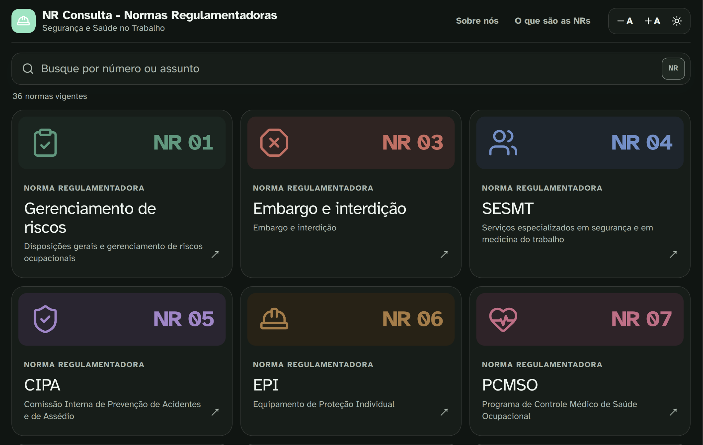
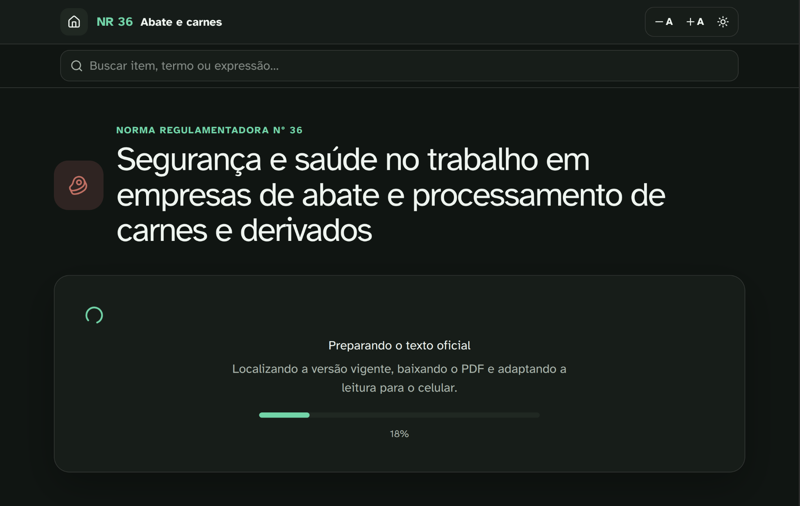
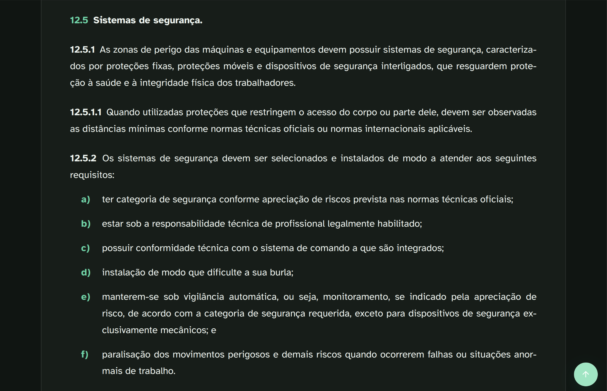

# NR Consulta - Normas Regulamentadoras

Aplicativo gratuito e de código aberto para facilitar a consulta e a leitura das **Normas Regulamentadoras (NRs) brasileiras** de Segurança e Saúde no Trabalho.

O **NR Consulta** foi desenvolvido para oferecer uma forma simples, rápida e agradável de acessar as NRs em computadores e dispositivos móveis, com uma interface otimizada para leitura e pesquisa.

> 🇧🇷 Este projeto é voltado às **Normas Regulamentadoras brasileiras**.

## 📱 Funcionalidades

- Consulta às Normas Regulamentadoras vigentes em tempo real;
- busca de NRs por número ou assunto;
- pesquisa de palavras, itens e expressões dentro de cada norma;
- interface responsiva para computadores, tablets e smartphones;
- modo claro e escuro;
- controle do tamanho do texto;
- navegação facilitada entre os itens da norma;
- acesso ao texto das NRs em formato otimizado para leitura;
- instalação como **Progressive Web App (PWA)**.

## 🖼️ Capturas de tela

### Consulta das Normas Regulamentadoras

### Download e processamento do arquivo PDF oficial

### Leitura otimizada

## 🎯 Objetivo

As Normas Regulamentadoras são documentos fundamentais para a Segurança e Saúde no Trabalho no Brasil.

O NR Consulta busca tornar esse conteúdo mais acessível, oferecendo uma interface moderna e adequada à consulta rápida e à leitura, especialmente em dispositivos móveis.

## 🌐 Fonte das normas

Os textos das Normas Regulamentadoras têm como referência as versões oficiais disponibilizadas pelo **Ministério do Trabalho e Emprego (MTE) do Brasil**.

O NR Consulta apenas facilita a consulta e a visualização dessas informações.

> **Aviso:** este é um projeto independente e não oficial. O NR Consulta não representa, não é mantido e não possui vínculo institucional com o Ministério do Trabalho e Emprego ou com o Governo Federal. Em caso de divergência, deve prevalecer o texto publicado pelos canais oficiais do Governo Federal.

## 💻 Código aberto

O NR Consulta é um projeto de código aberto.

Contribuições, correções e sugestões são bem-vindas.

## 📄 Licença

Este projeto é distribuído sob a **GNU General Public License v3.0 (GPL-3.0)**.

Copyright © 2026 Sandersom Fávero.

Você pode utilizar, estudar, modificar e redistribuir este software nos termos da licença GPL-3.0.

---

# English

**NR Consulta** is a free and open-source application designed to make Brazilian **Regulatory Standards (Normas Regulamentadoras — NRs)** for Occupational Safety and Health easier to browse, search and read.

The application provides a modern and responsive interface optimized for both desktop and mobile devices.

> 🇧🇷 This project covers **Brazilian occupational safety and health regulations**.

The regulatory texts are based on the official versions published by the **Brazilian Ministry of Labor and Employment (Ministério do Trabalho e Emprego — MTE)**.

**Disclaimer:** NR Consulta is an independent and unofficial project. It is not affiliated with, maintained by, or officially endorsed by the Brazilian Ministry of Labor and Employment or the Brazilian Federal Government.

## License

Licensed under the **GNU General Public License v3.0 (GPL-3.0)**.

Copyright © 2026 Sandersom Fávero.
